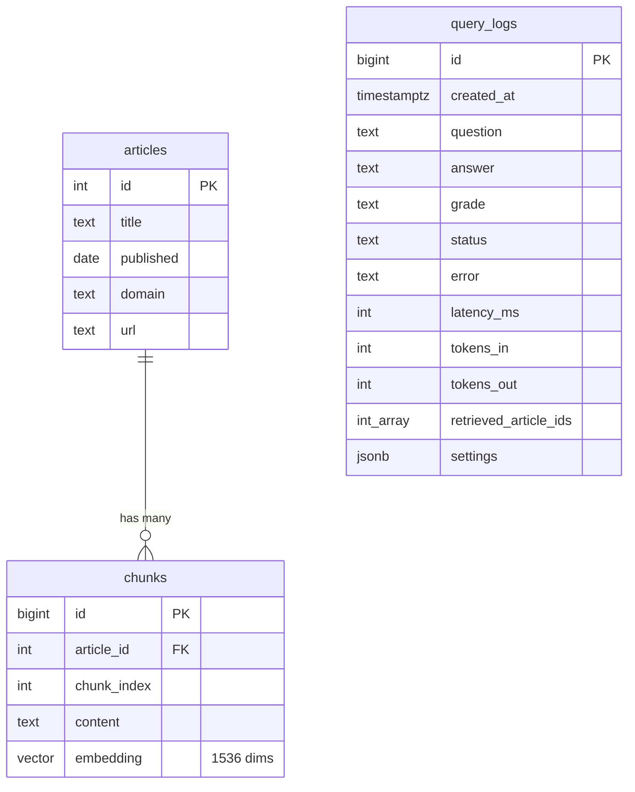

# CleanTech RAG


Production redeploy of my Agentic RAG system over 20,111 clean-tech news articles: LangGraph, FastAPI, Postgres + pgvector, Docker, Prometheus, Grafana. Kubernetes (k3s) deployment in progress.

## Pipeline

Built as a LangGraph graph: `retrieve → generate → grade`.

1. **Embed the question** with `text-embedding-3-small` (1536 dims).
2. **Vector search** in Postgres + pgvector using an HNSW index (`ef_search=200`). Fetch the 20 nearest chunks.
3. **Rerank** those 20 chunks with the cross-encoder `cross-encoder/ms-marco-MiniLM-L-6-v2`, and keep the top 10.
4. **Generate** an answer with `gpt-4-turbo`, using only the retrieved chunks and citing article IDs. If the chunks don't contain the answer, the model says so instead of guessing.
5. **Grade** the answer: a second LLM call checks whether every claim is supported by the retrieved chunks. Unsupported answers get a visible warning.

### The grader fails closed

If the grader itself crashes (API outage, bad output), the answer is marked `grader_error` and gets the warning. It is never silently approved. Verified by forcing a grader failure with an invalid model name.

### Why rerank?

Embedding search compares the question and each chunk *separately*, as two vectors. A cross-encoder reads the question and a chunk *together* and scores how well that chunk answers the question. It's more accurate but much slower, so it only runs on the 20 candidates from vector search, not on all 131,587 chunks.

### Why 10 chunks?

Most eval questions compare two things and need two different articles. With 5 chunks, the second article was often cut off and the model refused to answer. Sending 10 halved the refusals.

## Service

FastAPI app with three endpoints:

| Endpoint | Purpose |
|---|---|
| `GET /health` | Returns 200 only if the app can reach Postgres, 503 otherwise. Used for Kubernetes health checks. |
| `POST /ask` | Runs the pipeline. Validates input (3 to 500 characters), returns the answer, grade, sources, and token usage. Failures return a clean 502 with no internal details. |
| `GET /metrics` | Prometheus metrics: request counts by status, latency histogram, tokens used, grader verdicts. |

Every `/ask` request, successful or failed, is written to a `query_logs` table with its latency, tokens, grade, retrieved articles, and the settings that produced it. Logging never breaks a user request: if the log write fails, the answer is still returned.

### Monitoring

Prometheus scrapes `/metrics` every 15 seconds. Grafana ships with a provisioned dashboard (requests per minute, error rate, p50/p95 latency, tokens per minute). Both the data source and the dashboard are defined in files under `monitoring/`, so the whole stack comes up configured with no manual setup.

### CI

GitHub Actions runs the test suite on every push. The tests replace the LangGraph pipeline and the database logger with fakes, so CI needs no API key, no database, and makes no paid calls.

## Settings

All configurable through environment variables:

| Variable | Value | Purpose |
|---|---|---|
| `HNSW_EF_SEARCH` | 200 | HNSW search breadth |
| `FETCH_K` | 20 | chunks fetched before reranking |
| `RERANK` | true | enable the reranker |
| `RERANK_MODEL` | `cross-encoder/ms-marco-MiniLM-L-6-v2` | reranker model |
| `TOP_K` | 10 | chunks sent to the LLM |
| `LLM_MODEL` | `gpt-4-turbo` | answer, grader, and judge model |
| `GRADER` | true | enable the grader node |
| `OPENAI_MAX_RETRIES` | 5 (scripts), 1 (API) | retries on OpenAI errors |
| `OPENAI_TIMEOUT` | 60 (scripts), 30 (API) | seconds before an OpenAI call is abandoned |

## Database schema



## Findings

Eval set: 50 multi-document questions, each with a reference answer and the IDs of the articles needed to answer it. Corpus: 20,111 articles, 131,587 chunks.

### 1. HNSW `ef_search` tuning (retrieval)

| ef_search | recall@5 | recall@10 | recall@20 | search p50 |
|---|---|---|---|---|
| 40 (default) | 0.383 | 0.443 | 0.533 | ~28 ms |
| 100 | 0.413 | 0.483 | 0.583 | not measured |
| 200 | 0.433 | 0.493 | 0.593 | ~60 ms |
| exact (no index) | 0.423 | 0.493 | 0.603 | seconds |

The default setting was silently losing recall. Raising it to 200 recovered nearly all of it for ~30–40 ms extra. Question embeddings are cached, so retrieval eval results are reproducible run to run.

### 2. Rerankers (retrieval)

Fetch top 20, rerank, measure recall at the new positions.

| Setup | recall@5 | recall@10 | rerank p50 | rerank p95 |
|---|---|---|---|---|
| no reranker | 0.433 | 0.493 | n/a | n/a |
| MiniLM (90 MB) | 0.447 | 0.547 | ~100 ms | ~200 ms |
| bge-reranker-base (~1 GB) | 0.473 | 0.523 | ~540 ms | ~3.9 s |

Latency measured on an M2 MacBook (CPU), so it will differ on a server.

### 3. End-to-end answer quality

Each answer scored 1–5 by an LLM judge against the reference answer.

| Setup | Avg score | Refusals | Recall | Latency p50 | Tokens in |
|---|---|---|---|---|---|
| baseline (5 chunks) | 3.00 | 10 | 0.423 | 10.0 s | 1,071 |
| HyDE | 2.94 | 10 | 0.443 | 16.9 s | 1,143 |
| bge rerank, 5 chunks | 3.12 | 10 | 0.473 | 13.2 s | 1,072 |
| 10 chunks | 3.30 | 7 | 0.493 | 10.9 s | 2,053 |
| **MiniLM rerank, 10 chunks** | **3.44** | **5** | **0.547** | **10.6 s** | 2,052 |

**Chosen setup: MiniLM rerank, fetch 20, keep 10.** Best on every quality measure, with no extra latency over plain 10-chunk retrieval.

Retrieval metrics alone pointed toward bge at top 5. The answer-level eval showed MiniLM with 10 chunks wins clearly. Reranker choice and chunk count have to be evaluated together.

HyDE did not help here, but this implementation keeps only one chunk per article when merging (inherited from the original notebook), which often sent the LLM *less* context than the baseline. A retest with a better merge is planned.

**Caveats:** each setup was run once. Generation and judging are not fully deterministic, so differences under ~0.15 should be treated with care. The judge uses the same model as the generator, which may bias scores. A full 50-question run with the grader enabled is pending.

### 4. Fail fast on unrecoverable errors

Query logs showed a failed `/ask` request taking 16.4 s: the OpenAI client was retrying 5 times with backoff, a setting meant for batch ingestion. Making retries and timeouts configurable per environment (scripts keep 5 retries, the API uses 1) cut failed-request latency to 1.95 s.

### Resolved hard case

Iceland geothermal turbines (answer: Japan, article 47341). The correct chunk ranked #12 in vector search, so top-5 retrieval missed it and the system answered "I don't know." With reranking, it moves to #1 and the system answers correctly with a citation, graded `grounded`.

## Running locally

```bash
docker compose up -d --build     # app, Postgres, Prometheus, Grafana
```

| Service | URL |
|---|---|
| API docs | http://localhost:8000/docs |
| Prometheus | http://localhost:9090 |
| Grafana | http://localhost:3000 |

Requires a `.env` file with `OPENAI_API_KEY` and the settings above.

### Tests and evals

```bash
python -m pytest -v                                        # unit tests (no API calls)
python -m scripts.eval_retrieval                           # retrieval eval, current settings
python -m scripts.eval_retrieval --rerank                  # retrieval with reranker
python -m scripts.eval_answers --name my_run               # full answer eval (uses API credits)
python -m scripts.eval_answers --name k10 --top-k 10       # override a setting
```

## Roadmap

- [x] Ingestion, HNSW tuning, reranking, grader
- [x] Retrieval and answer-level evals
- [x] FastAPI service, query logging, Prometheus + Grafana, CI
- [ ] Kubernetes (k3s) manifests, rehearsed locally with k3d
- [ ] Terraform for the VPS
- [ ] Deploy and operate for ~3 months: drift detection, load testing, cost optimization