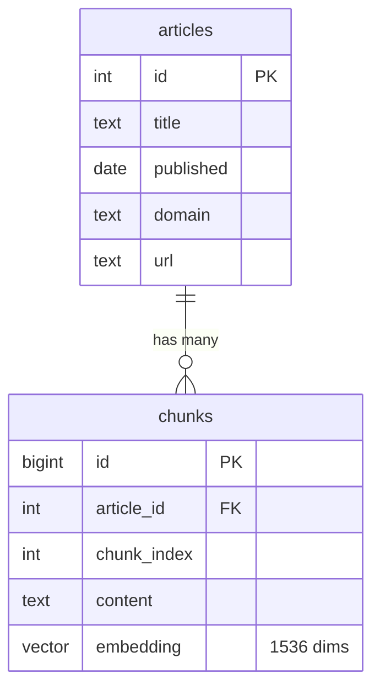

# CleanTech RAG

Production redeploy of my Agentic RAG system: FastAPI, Postgres + pgvector, Docker, k3s.

## Database schema

```mermaid
erDiagram
    articles ||--o{ chunks : "has many"
    articles {
        int id PK
        text title
        date published
        text domain
        text url
    }
    chunks {
        bigint id PK
        int article_id FK
        int chunk_index
        text content
        vector embedding "1536 dims"
    }
```