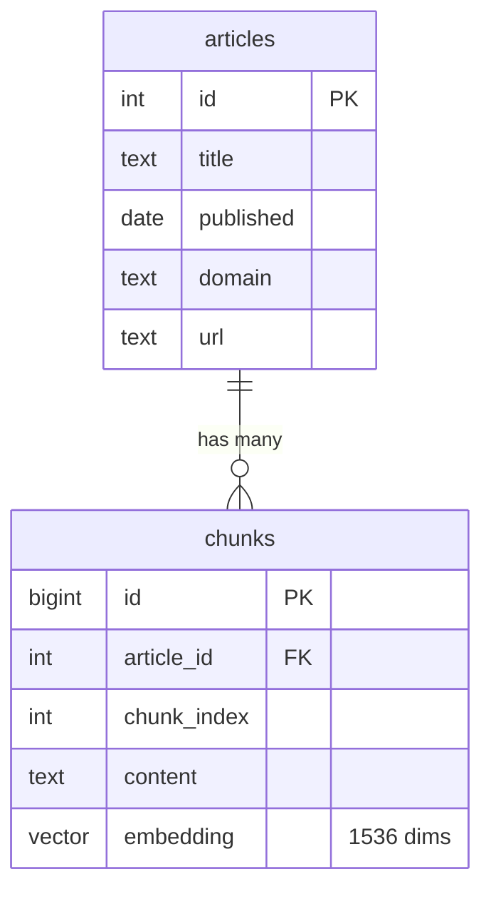

# CleanTech RAG

Production redeploy of my Agentic RAG system: FastAPI, Postgres + pgvector, Docker, k3s.

## Database schema

## Findings

All retrieval numbers: 50-question multi-document eval set, 131,587 chunks, `text-embedding-3-small`.

### HNSW `ef_search` tuning

| ef_search | recall@5 | recall@10 | recall@20 | search p50 |
|---|---|---|---|---|
| 40 (default) | 0.383 | 0.443 | 0.533 | ~28 ms |
| 100 | 0.413 | 0.483 | 0.583 | not measured |
| 200 | 0.423–0.433 | 0.493 | 0.593 | ~60 ms |
| exact (no index) | 0.423 | 0.493 | 0.603 | seconds |

Raising `ef_search` from 40 to 200 recovered most of the recall lost to approximate search, at ~30–40 ms higher median latency. LLM generation takes ~11 s per query, so retrieval latency is not the bottleneck.

Recall@5 varies by about ±0.01 between runs because the embedding API is not perfectly deterministic.

### Known hard case

Iceland geothermal turbines (answer: Japan, article 47341): the correct chunk ranks #12 by exact search, so top-5 retrieval misses it. Candidate fix: retrieve top 20, then rerank.